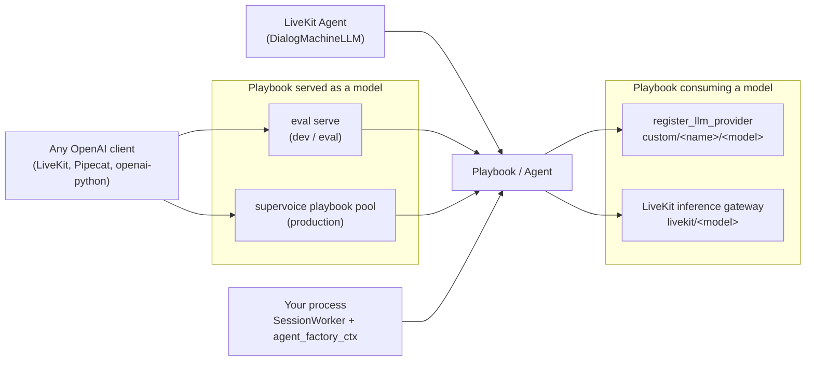

# SuperDialog - Integrations

SuperDialog is a library, so every integration is one of four seams: a
Playbook served *as* an OpenAI-compatible model, an OpenAI-compatible model
consumed *by* a Playbook, a voice framework driving a Playbook turn-by-turn,
or a host process embedding `SessionWorker` directly. This doc covers those
seams and disambiguates the two unrelated LiveKit integrations that share a
vendor name. Host-specific wiring snippets live in
[03-embedding-guides.md](03-embedding-guides.md); this doc covers the
contracts those snippets depend on.

---

## 1. Seam map

Six concrete entry points across those four kinds of seam.



| Seam | Direction | Entry point |
|---|---|---|
| OpenAI door (dev) | client → Playbook | `eval/server/openai_server.py::build_app` |
| OpenAI door (prod) | client → Playbook | supervoice `playbook_pool/openai_api.py::build_openai_app` |
| Custom LLM provider | Playbook → any OpenAI-shaped API | `llm/registry.py::register_llm_provider` |
| LiveKit as brain host | LiveKit → Playbook | `adapters/livekit.py::DialogMachineLLM` |
| LiveKit as LLM vendor | Playbook → LiveKit | `llm/livekit_gateway.py::register_livekit_inference` |
| Direct embedding | your process → Playbook | `session/worker.py::SessionWorker` |

---

## 2. A Playbook behind an OpenAI-compatible endpoint

The same idea ships through two independent doors. They are *not* the same
server, and they do not have the same contract - pick by whether you are
evaluating or serving traffic.

| | Door A - `superdialog eval serve` | Door B - supervoice playbook pool |
|---|---|---|
| Code | `eval/server/openai_server.py::build_app` | supervoice `playbook_pool/openai_api.py::build_openai_app` |
| Playbook source | one file, passed on the CLI | published playbook, fetched per request by id |
| `model` means | `superdialog/<stem>` or `superdialog-vanilla/<stem>` | the playbook id |
| `GET /v1/models` | yes | no |
| `GET /health` | no | yes |
| Auth | none | Bearer token → `org_id` |
| Session key | `user` field (default `"default"`) | `user` field or `X-Session-Id` header |
| Streaming | SSE-shaped, one content frame | real incremental tokens |
| Usage counters | always zero | real token totals (`register_llm_callback`) |
| Multi-tenant | no | yes (store keys namespaced by `org_id`) |

### 2.1 Door A - `superdialog eval serve`

Serves ONE playbook file as two models so an external harness can A/B the
playbook engine against the same playbook flattened into a system prompt.
Needs the `fastapi` extra (`fastapi` + `uvicorn`).

```bash
superdialog eval serve --playbook my_agent.simple.yaml --port 8000
```

```
GET  /v1/models            -> {"object": "list", "data": [
                                {"id": "superdialog/my_agent.simple", ...},
                                {"id": "superdialog-vanilla/my_agent.simple", ...}]}
POST /v1/chat/completions   {model, messages, user, stream}
```

Contract, as built by `build_app`:

- The two model ids are derived from the playbook filename stem. A `model`
  starting with `superdialog-vanilla` routes to
  `eval/endpoints/in_process.py::InProcessVanilla` (single LLM, playbook text
  as the system prompt); anything else routes to `InProcessPlaybook`
  (`DialogMachine(engine="playbook")`).
- Sessions are server-side and keyed by `(mode, user)`. A fresh `user`
  string starts a new conversation; omitting `user` puts **every** caller on
  the shared key `"default"`. The map is an LRU bounded by `build_app`'s
  `max_sessions` (256; not exposed as a CLI flag).
- Only the **last** `role: "user"` message drives the turn. A request with no
  user message returns the greeting from `ConversationEndpoint.start()` when
  it creates the session, and an empty string on a session that already
  exists.
- `stream: true` returns `text/event-stream`, but the body is the complete
  reply in a single `chat.completion.chunk`, then a `finish_reason: "stop"`
  chunk, then `data: [DONE]`. It is SSE-shaped, not token-by-token.
- `usage` is always `{prompt_tokens: 0, completion_tokens: 0, total_tokens: 0}`.
- There is no auth and no `/health`. Do not expose it publicly.
- `InProcessPlaybook` widens `barrier_timeout` and `hold_timeout` to 120s and
  sets `settle_before_speak=True` (`_OFFLINE_BARRIER_S` / `_OFFLINE_HOLD_S`) -
  correct for offline scoring, wrong for a live call, which is the structural
  reason this door is not the production one.

CLI flags (`cli/main.py`, `eval/cli.py::cmd_serve`): `--playbook` (required),
`--agent-model` (default `openai/gpt-4.1-mini`), `--port` (default 8000).
`--mode` is accepted but unused - the engine is chosen per request by the
`model` prefix. `cmd_serve` reads `director_model`/`talker_model` off the
namespace via `getattr`, but this subparser defines neither, so both are
always `None`; per-role model overrides are available on `eval run` /
`eval bench`, not on `serve`. Operator runbook:
[07-running-evals.md](07-running-evals.md) §3.

### 2.2 Door B - the supervoice playbook pool (production)

Unpod runs a standing multi-tenant Agent Runner - the *playbook pool* - that
hot-loads a published playbook per request. `model` is the playbook id; the
Bearer token resolves to an `org_id` server-side; a session id (the OpenAI
`user` field or an `X-Session-Id` header) makes the conversation stateful,
and its absence makes each request a fresh session. Streaming is real - the
pool drives `stream()` on the agent, so tokens reach the caller as they are
generated.

That door composes this library: `build_openai_app` takes a
`superdialog.session.SessionWorker`, builds a `SessionInit` per request
(§5), and wires metering through `register_llm_callback`
([01-architecture.md](01-architecture.md) §5.2). The internal store key is
`{org_id}:{session_id}`, so one org cannot address another's session by
guessing an id. When the playbook reaches its terminal checkpoint the pool
calls `close_session(..., persist=False)` and refuses later reuse of that id
with HTTP 410 - a finished conversation behaves like a hung-up call, not a
silent restart at checkpoint 0.

Full contract, deployment, and the publish saga that puts a playbook behind
this door: supervoice
[03-publish-and-runners.md](../../supervoice/docs/03-publish-and-runners.md)
§3.

### 2.3 The client side

Both doors are ordinary OpenAI endpoints, so any OpenAI client works with
`base_url` + `model` and nothing else. Pin the session id where the client
allows it: LiveKit's `openai.LLM` passes `user=`, Pipecat's
`OpenAILLMService` has no `user` passthrough and needs
`default_headers={"X-Session-Id": ...}` (Door B only - Door A reads only
`user`). Runnable harnesses for exactly this, against a real socket rather
than an ASGI shim, live in
[`supervoice/tests/playbook_pool/`](../../supervoice/tests/playbook_pool/):
`local_pool_server.py` (the endpoint over a playbook on disk),
`chat_livekit.py` / `chat_pipecat.py` (interactive text),
`call_agent_livekit.py` / `call_agent_pipecat.py` (full STT → LLM → TTS
calls), and `test_openai_api_frameworks.py` (the contract asserted through
both frameworks' own clients).

---

## 3. Consuming an OpenAI-compatible endpoint back

The reverse direction: point a Playbook's own LLM at any OpenAI-shaped API -
a vLLM host, a gateway, another Playbook door - by registering it once and
addressing it with a `custom/` URI.

```python
from superdialog import DialogMachine, register_llm_provider

register_llm_provider("my-gateway", "https://gateway.example.com/v1", api_key="sk-...")
dm = DialogMachine("kyc.yaml", llm="custom/my-gateway/gpt-4.1-mini")
```

- `register_llm_provider(name, base_url, api_key, api_style="openai")` stores a
  `CustomProviderConfig` in a process-global registry (`llm/registry.py`).
- `custom/<name>/<model>` resolves through LiteLLM with the registered
  `api_base` and `api_key`, regardless of `SUPERDIALOG_LLM_BACKEND` - the
  short-circuit past the backend selector lives in
  `llm/resolver.py::_build_backend`, the registry lookup and
  `LitellmProvider` construction in `llm/resolver.py::_litellm_resolve`. The
  URI is split on the first two slashes only, so everything after `<name>`
  is the model:
  `custom/my-gateway/openai/gpt-4.1-mini` sends `openai/gpt-4.1-mini`
  upstream.
- `api_key` may be a **zero-arg callable** returning a fresh token per
  request. `LitellmProvider` resolves it on every call
  (`_resolve_dynamic_credentials`), so a short-lived credential never
  expires mid-conversation.
- Caveat when the far end is a Playbook door: superdialog's own call sites
  never set `user`, and the registry has no place to pin a session header,
  so the far side falls back to its default - a new session per request on
  Door B, the shared `"default"` session on Door A. Chaining playbook →
  playbook is therefore stateless on the callee unless you drive it with your
  own client.

The full URI table (every scheme, the backend selector, `@host` forms) is in
[01-architecture.md](01-architecture.md) §5.3.

---

## 4. The two LiveKit integrations

LiveKit appears twice in this repo, in **opposite directions**. They share
nothing but the vendor name and are routinely confused.

| | `adapters/livekit.py` | `llm/livekit_gateway.py` |
|---|---|---|
| Role of LiveKit | agent host (media + turn taking) | LLM inference vendor |
| Role of superdialog | the brain LiveKit calls | the client calling LiveKit |
| Symbol | `DialogMachineLLM`, `DialogMachineStream` | `register_livekit_inference`, `LiveKitTokenSource` |
| Wired by | `Agent(llm=DialogMachineLLM(agent))` | a `livekit/<model>` or `custom/lk-inference/<model>` URI |
| Needs | `livekit` extra (`livekit-agents>=0.12`) | `LIVEKIT_API_KEY` + `LIVEKIT_API_SECRET`; the SDK only to mint the token |
| Related doc | [03-embedding-guides.md](03-embedding-guides.md) §2 | [01-architecture.md](01-architecture.md) §5.3 |

They compose: a LiveKit voice agent running `DialogMachineLLM`, whose
Director and Talker resolve to `livekit/<model>`, uses both at once.

### 4.1 LiveKit as the host - `DialogMachineLLM`

Quacks like `livekit.agents.llm.LLM` (the same shape
`livekit-plugins-langchain` uses), so any superdialog `Agent` -
`DialogMachine`, `PlaybookAgent`, `LLMAgent`, a custom Protocol impl - drops
into `Agent(llm=...)`. `chat(chat_ctx=...)` returns a `DialogMachineStream`
that pulls the latest user text out of LiveKit's `ChatContext`, drives
`agent.turn(text, stream=True)`, and renders each `StreamChunk` as a LiveKit
`ChatChunk`. Importing the module without `livekit-agents` installed is safe;
only construction raises (`_require_livekit`). Chunk construction probes
several constructor shapes across livekit-agents versions and falls back to a
plain dict, so a minor-version bump degrades rather than breaks.

### 4.2 LiveKit as the vendor - the inference gateway

LiveKit Cloud's agent gateway is an OpenAI-compatible inference endpoint
authenticated with a short-lived JWT minted from the LiveKit API key/secret.
Two URI forms reach it:

- `livekit/<model>` → `OpenAIProvider(..., livekit=True)`, forced onto the
  OpenAI SDK backend regardless of `SUPERDIALOG_LLM_BACKEND` so a stray
  `LIVEKIT_API_KEY` in the environment can never reroute unrelated models
  (`llm/resolver.py::_build_backend`).
- `custom/lk-inference/<model>` → LiteLLM against the gateway. If the
  provider name is unregistered, the resolver self-registers it from env via
  `register_livekit_inference()`, whose `api_key` is a `LiveKitTokenSource`
  callable - the token is re-minted before it lapses (TTL 1800s, 120s refresh
  margin) so a long call never reuses an expired JWT.

Credentials come from `LIVEKIT_API_KEY`/`LIVEKIT_API_SECRET` (or the
`LIVEKIT_INFERENCE_*` aliases); the base URL from `LIVEKIT_INFERENCE_URL`,
else the staging gateway when `LIVEKIT_URL` points at staging, else the
production gateway. URL resolution and registration deliberately avoid
importing `livekit-agents` - only `mint_livekit_token` needs the SDK, and it
raises a pointed error naming the `livekit` extra when it is missing. The
registry name `lk-inference` matches the parent voice repo's own
`lite_v2/llm_routing.py::INFERENCE_PROVIDER_NAME`, so both emit URIs under
the same provider prefix.

---

## 5. Embedding with `SessionInit` / `agent_factory_ctx`

This is the seam the production pool uses, not a demo path. A single
`SessionWorker` multiplexes N concurrent conversations in one process and
builds a **different agent per session** from context supplied at acquire
time.

```python
from superdialog.session import SessionInit, SessionWorker

def factory(init: SessionInit):
    return build_agent_for(init.metadata["playbook_id"])   # your resolution

worker = SessionWorker(agent_factory_ctx=factory, store=my_store)

async with worker.acquire(session_id, init=SessionInit(
    session_id=session_id,
    metadata={"playbook_id": "roast-bot"},
)) as handle:
    reply = await handle.turn(user_text)
```

Contract (`session/worker.py::SessionWorker`, `session/session.py`):

- Exactly one of `agent_factory` (zero-arg) or `agent_factory_ctx`
  (`Callable[[SessionInit], Agent]`) - passing both or neither raises
  `ValueError`.
- `init` is **bind-at-creation**: consumed only when the session is first
  built. A cached session is returned untouched, so per-session identity
  cannot be swapped underneath a live conversation.
- `acquire` serialises concurrent turns on one `session_id` through a
  pluggable `LockBackend` (asyncio by default), loads any persisted record
  into the fresh agent, yields a `SessionHandle` (`turn`, `assist`, `state`),
  and on exit pulls state back out and persists a `SessionRecord`.
- Persistence is a three-method Protocol - `SessionStore.load/save/delete`
  (`session/store.py`). `InMemorySessionStore` is the default;
  `NullSessionStore` disables persistence. supervoice ships a Redis
  implementation of the same Protocol
  (`playbook_pool/session_store.py::RedisSessionStore`), which is what makes a
  call resume across a pod restart.
- The LRU is bounded by `max_sessions` (default 1000); eviction persists
  before dropping.
- `close_session(session_id, persist=False)` **deletes** the record rather
  than saving it - the only correct ending for a terminal conversation, since
  a saved transcript would reload into a freshly restarted machine on the
  next `acquire`.

The production embedding, for reference: supervoice's
`playbook_pool/pool_runner.py::build_session_worker` passes an
`agent_factory_ctx` built by `playbook_pool/entrypoint.py::make_playbook_factory`,
which reads the pre-resolved playbook the caller stashed on
`init.metadata["_resolved"]`. Both of that pool's front doors - the voice
Agent Runner and the OpenAI endpoint of §2.2 - compose the *same* worker,
which is why a session behaves identically on either transport.

---

## Consumed by

Sibling checkouts of the two repos that embed this library, not files in this
package.

- **supervoice** -
  [04-connectivity.md](../../supervoice/docs/04-connectivity.md) is the
  canonical cross-repo story: how a phone number, a voice profile, and a
  running brain rendezvous, and which of the three connectivity modes each
  seam here corresponds to (§2.2 is Mode B, §5 is Mode C).
- **supervoice** -
  [03-publish-and-runners.md](../../supervoice/docs/03-publish-and-runners.md)
  for the publish saga and pool operations behind Door B.
- **unpod-sdk** -
  [06-deployment.md](../../unpod-sdk/docs/06-deployment.md) puts the same
  doors in front of a developer: its mechanism 1 is Door B (§2.2), and its
  §"The local alternative" is Door A (§2.1).
- **unpod-sdk** -
  [02-run-your-agent.md](../../unpod-sdk/docs/02-run-your-agent.md) for the
  other way a Playbook reaches a live call: an Agent Runner wrapping it in
  `SuperDialogAdapter` rather than a door serving it as a model.

## Related docs

- [01-architecture.md](01-architecture.md) - §5.2 `register_llm_callback`,
  §5.3 the full model-URI table, §5.4 resilience
- [02-api-reference.md](02-api-reference.md) - signatures and model fields
- [03-embedding-guides.md](03-embedding-guides.md) - host-by-host wiring
  snippets (CLI, LiveKit, PipeCat, FastAPI, tests)
- [07-running-evals.md](07-running-evals.md) - the operator runbook that owns
  `eval serve`
