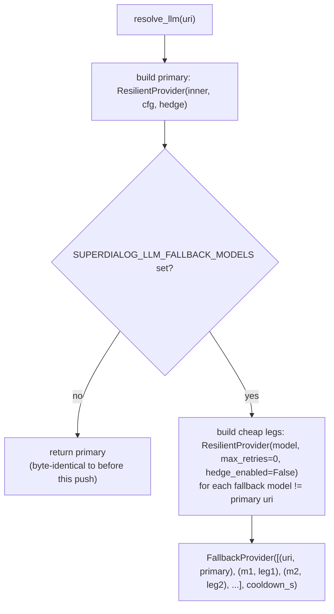
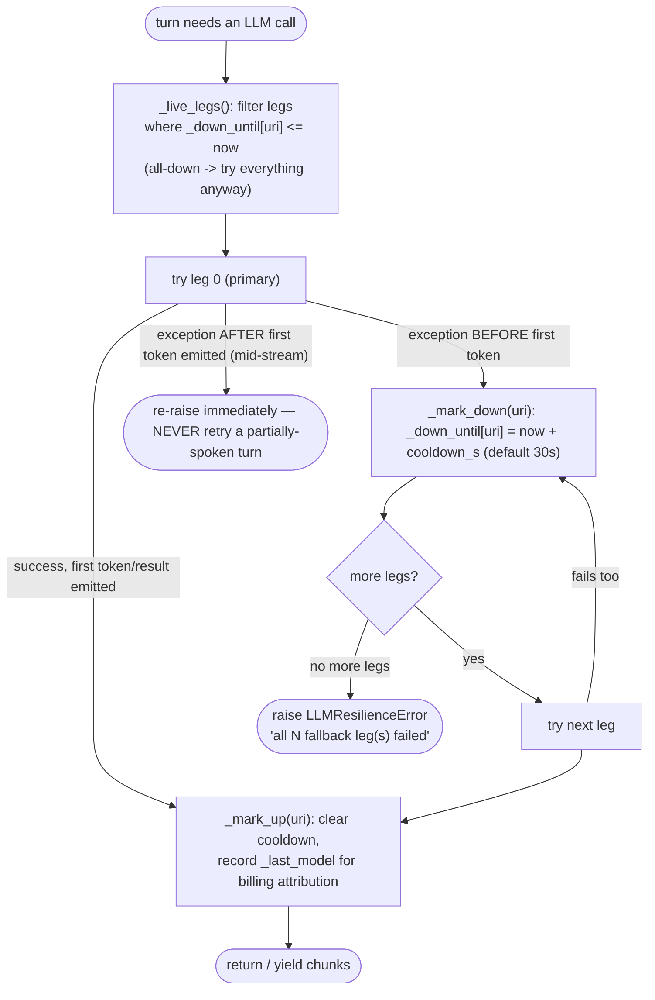
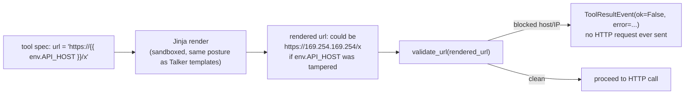
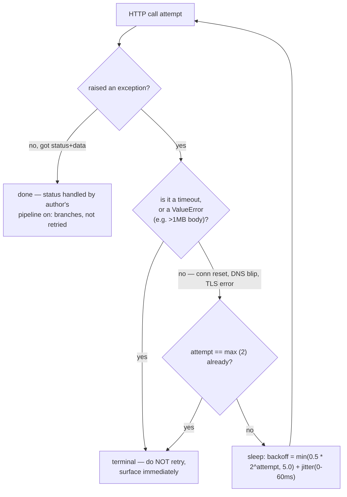
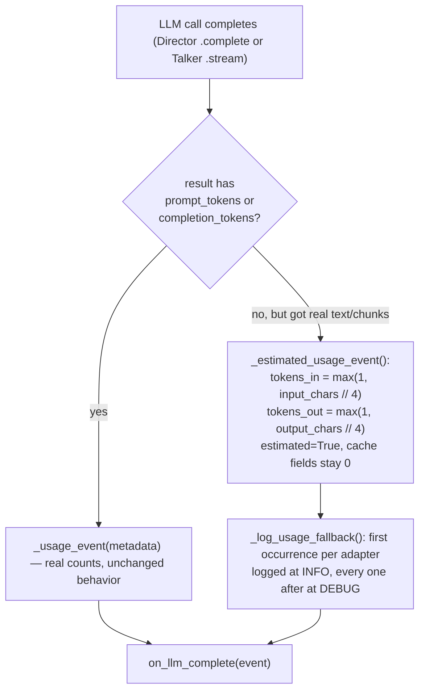
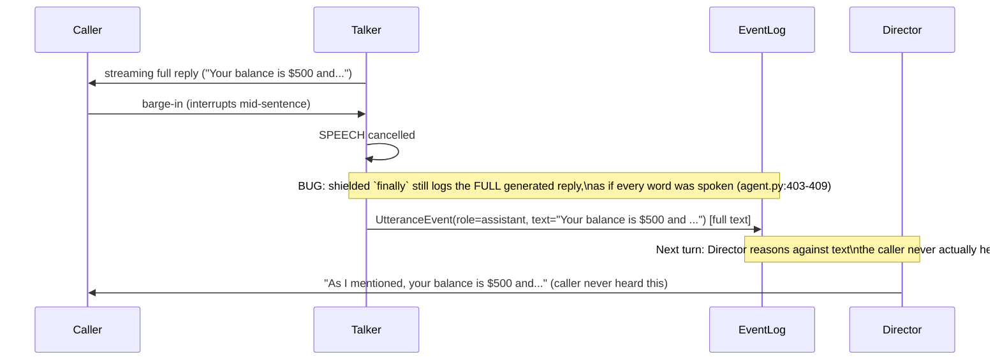
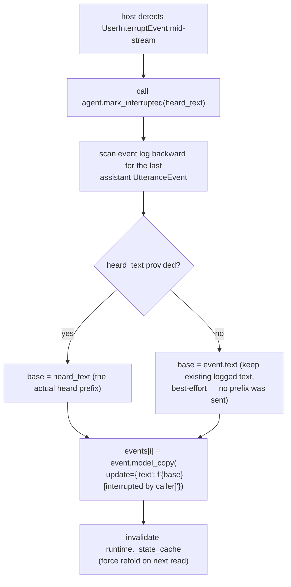

# SuperDialog - LLM Resilience, SSRF Hardening & Observability (2026-07-24)

**Status:** Canonical
**Parent:** [README.md](README.md)
**Covers commit range:** `5990498..372807e` (main)
**Files touched:** `src/superdialog/llm/{fallback,resolver,provider,anyllm_provider,openai_provider,litellm_provider,resilience}.py`,
`src/superdialog/playbook/{_ssrf,toolexec,agent,providers,render,runtime,supervisor}.py`,
plus matching test files.

This is a code-verified walkthrough (file:line-level) of a batch of changes
that lands four independent hardening tracks in one push: an LLM fallback
chain, an SSRF guard on playbook tool calls, transport-level retry/limits on
the tool executor, and a barge-in correctness fix — with a fifth, cross-
cutting cleanup (structured logging) touching almost every file in the diff.

---

## 0. Why these five things landed together

None of the five depend on each other, but they share one motivation: today's
`RetryPolicy`/`ResilientProvider` wrap already covers *per-request* failure
(timeout, retry, hedge — see [01-architecture.md](01-architecture.md)). This
push covers everything that layer does **not**: what happens when a whole
provider is down, not just one call; what happens when a tool call's target
host is attacker- or config-controlled; what happens when a backend reports
no token usage at all; what happens when a caller barges in mid-speech; and
the fact that `print()`-based tracing is invisible to any real log pipeline.

```
┌─────────────────────────────────────────────────────────────────────┐
│                     BEFORE this push                                │
│                                                                       │
│  one call fails → ResilientProvider retries/hedges → still fails    │
│  → turn fails, no other model tried                                  │
│                                                                       │
│  tool URL renders to http://169.254.169.254/... → fetched, no check │
│                                                                       │
│  backend returns no usage object → billed as 0 tokens, silently     │
│                                                                       │
│  caller barges in → full unspoken reply still logged as "said"      │
│  → Director reasons next turn against words never heard              │
│                                                                       │
│  trace lines are print(..., flush=True) → invisible to log pipeline │
└─────────────────────────────────────────────────────────────────────┘
```

---

## 1. LLM fallback chain

**New file:** `src/superdialog/llm/fallback.py`
**Wired in:** `src/superdialog/llm/resolver.py:158-196` (`resolve_llm`)

### What problem it solves

`ResilientProvider` (existing) retries and optionally hedges *the same
provider*. If the primary provider/key is genuinely down (revoked key,
regional outage, rate-limited into the ground), retrying it harder does
nothing. There was no way to say "if Anthropic is down, fall over to OpenAI
for this call."

### The mechanism



Per-turn call flow inside `FallbackProvider.stream()` /
`FallbackProvider.complete()` (`fallback.py:100-171`):



Key design decisions, and the reasoning baked into the code/comments:

- **Cooldown is process-wide, keyed by URI** (`fallback.py:40`,
  `_down_until: dict[str, float]`), not per-`FallbackProvider` instance.
  Providers are constructed per-session, so instance-level cooldown state
  would "rediscover" a dead primary once per session instead of once per
  cooldown window per process. A dict write is safe with no lock because
  asyncio is single-threaded.
- **Leg 0 is the exact wrap that existed before this push** (retry + hedge).
  Legs 1..N are cheap (`max_retries=0`, `hedge_enabled=False`) so total
  worst-case attempts per turn stay bounded at
  `(max_retries + 1) + n_fallbacks`, not a combinatorial explosion.
- **Failover fires on ANY exception before the first token** — not just
  specific error types — because fallback legs are different
  providers/keys entirely; a revoked primary key is *exactly* the scenario
  this exists for (`fallback.py:6-9`).
- **Mid-stream failures are never retried.** If the primary already emitted
  part of a spoken reply and then errors, that error surfaces unchanged. A
  caller must never hear a turn restart from scratch after they've already
  heard half of it (`fallback.py:9-11`, `stream()` at `162-166`).
- **An empty stream counts as a per-leg failure**, not a valid answer — so a
  leg that connects but yields nothing still triggers failover to the next
  leg (`fallback.py:158-161`).
- **Recovery is probe-free.** No background health-check pings a dead leg.
  It just sits on cooldown until the next real turn tries it again. Rationale
  in the file docstring: "add a cheap probe only if the cooldown-expiry
  turn's latency shows in p99" — i.e., don't build it until it's proven
  necessary.
- **`.model` property reports who actually answered**, not just the
  configured primary — so billing/attribution after a failover points at the
  fallback model that was actually used, not the one config says should have
  been (`fallback.py:86-90`).

### Config surface (`FallbackConfig.from_env`, `fallback.py:50-57`)

| Env var | Meaning | Default |
|---|---|---|
| `SUPERDIALOG_LLM_FALLBACK_MODELS` | Comma-separated model URIs, tried in order after the primary | unset = feature off |
| `SUPERDIALOG_LLM_FALLBACK_COOLDOWN_S` | Seconds a failed leg is skipped before retry | `30.0` |

Unset → `resolve_llm()` returns exactly what it returned before this push
(`resolver.py:181-182`). This is a strict opt-in, not a behavior change for
anyone not using the env var.

### Related: `warmup()` added across the board

To make failover cheap even on the very first turn, every provider now
exposes an optional `async def warmup()`:

- `FallbackProvider.warmup()` (`fallback.py:173-188`) — warms **every leg
  concurrently** via `anyio.create_task_group`, each leg guarding its own
  errors so one dead leg can't block warming the others.
- `ResilientProvider.warmup()` (`resilience.py:185-206`) — warms **both** the
  primary and the hedge leg concurrently. Explicit, not via `__getattr__`
  (which would only reach `.inner` and silently skip the hedge — and the
  hedge fires mid-turn, so an unwarmed hedge just relocates the cold-start
  problem instead of fixing it).
- `OpenAIProvider.warmup()` (`openai_provider.py:131-145`) — calls
  `client.models.list()` on the **same cached** `AsyncOpenAI` client the real
  first turn reuses, so DNS+TCP+TLS (~150-400ms) is paid during idle time
  (e.g. the phone's ring window) instead of on the opening turn's TTFT.
- `AnyLlmProvider.warmup()` (`anyllm_provider.py:163-180`) — builds the
  cached client (pays SDK import cost) and best-effort probes `models.list()`
  if the wrapped SDK exposes one.
- `LitellmProvider.warmup()` (`litellm_provider.py:31-36`) — intentional
  no-op: litellm keeps a process-global client cache, so there's no
  per-instance pool to pre-open; the first real request already warms every
  subsequent call.

All of these are **fire-and-forget**: every implementation swallows its own
exceptions (`except Exception: pass` / logged at DEBUG) so a warmup call can
never delay or fail a real turn. `warmup` is duck-typed and optional
(`provider.py:41-46`) — a caller must `getattr(provider, "warmup", None)`
before calling it, so minimal custom providers stay valid without
implementing it.

### Backend resolution caching note (`resolver.py:109-155`)

Unrelated to fallback directly but touched in the same file: `resolve_backend`
caches SDK-pool backends (`any-llm`/OpenAI) per `(backend_selector, uri)` key
for the process lifetime, so repeated resolves reuse one warm connection
pool. LiteLLM-backed results are deliberately **not** cached — litellm keeps
its own global cache, and `custom/` provider credentials live in a mutable
registry a stale cache entry would drift against.

---

## 2. SSRF guard on playbook tool URLs

**New file:** `src/superdialog/playbook/_ssrf.py`
**Wired in:** `src/superdialog/playbook/toolexec.py:278-291` (inside
`ToolExecutor.execute`)

### What problem it solves

A playbook tool spec's `url` field is a Jinja template rendered over
`{slots, env, results}` — and playbooks can be optimizer-generated or
user-authored. That means the actual hostname a tool call hits can be
influenced by `{{ env.SOME_VAR }}` or `{{ slots.user_input }}`. Without a
check, a maliciously (or accidentally) crafted playbook/slot value could
redirect a tool call to `http://169.254.169.254/latest/meta-data/...` (cloud
metadata endpoint — classic SSRF-to-credential-theft) or to internal
services on `localhost`/private ranges.

### Why it validates the RENDERED url, not the template



Validating the template string itself would be trivially bypassed — the
dangerous host only exists after interpolation, so the check has to run on
what's actually about to be fetched (`_ssrf.py:1-6`).

### The three layers of `validate_url()` (`_ssrf.py:85-106`)

1. **Scheme check** — must be `http`/`https`, else reject.
2. **Blocked hostname list** — `localhost`, `localhost.localdomain`,
   `ip6-localhost`, `ip6-loopback`, `metadata.google.internal`, `metadata`
   (`_ssrf.py:29-38`). These catch DNS-name-based SSRF that isn't a literal
   IP at all.
3. **Literal-IP range check**, via `resolve_literal_ip()` +
   `is_internal_ip()`.

### Why the IP parsing is more paranoid than `ipaddress.ip_address()` alone

`getaddrinfo`/the C resolver accepts numeric IPv4 in forms Python's
`ipaddress` module rejects outright: decimal (`2130706433` ==
`127.0.0.1`), octal (`0177.0.0.1`), hex (`0x7f.0.0.1`), and short forms
(`127.1`). If the guard only checked canonical dotted-quad, an attacker
could smuggle a private IP past it using any of these spellings and the
underlying HTTP client would still happily connect to it. `resolve_literal_ip()`
(`_ssrf.py:41-61`) tries `ipaddress.ip_address()` first, then falls back to
`socket.inet_aton()` — the same C-level parser the resolver itself uses — so
every spelling `getaddrinfo` would honor gets caught.

IPv4-mapped IPv6 (`::ffff:169.254.169.254`) is also unwrapped and checked
(`is_internal_ip`, `_ssrf.py:64-82`) — including a Python-version-specific
detail: on Python < 3.13, an IPv6 wrapper's `.is_private`/`.is_loopback`
flags don't reflect the embedded IPv4, so the code explicitly extracts
`.ipv4_mapped` and checks that too.

### Explicit non-goal: DNS rebinding

The docstring is upfront about this (`_ssrf.py:13-16`): a genuine hostname
(e.g. `evil.example.com`) is intentionally **not** resolved at validation
time — a synchronous DNS lookup here would stall the event loop. So this
guard cannot catch a hostname that resolves to a private IP only at request
time (classic TOCTOU/rebinding attack). The real protection the comment
leans on: tool URLs are **configuration** (playbook artifacts), not raw
caller-supplied free text — same trust boundary the sandboxed Jinja renderer
already assumes for SSTI.

### Opt-out for local dev

`allow_private_hosts: bool = False` is threaded through
`ToolExecutor.__init__` → `PlaybookRuntime.__init__` → `PlaybookAgent.__init__`
(all three files touched: `toolexec.py:183-194`, `runtime.py:80-93`,
`agent.py:115-134`), defaulting to strict (blocked) everywhere. A host that
needs to hit `localhost` mocks during development explicitly passes
`allow_private_hosts=True`.

---

## 3. Tool executor hardening (`toolexec.py`)

Same file as the SSRF guard, three more independent improvements landed
alongside it:

### 3a. Timeout clamp

```python
_MIN_TIMEOUT_S = 0.1
_MAX_TIMEOUT_S = 300.0
timeout = max(_MIN_TIMEOUT_S, min(spec.timeout, _MAX_TIMEOUT_S))
```

Clamped **at execute time**, not validated at playbook-load time — so a
persisted playbook with an out-of-range `timeout:` value still loads
successfully; it just runs clamped instead of failing to parse.

### 3b. Transport-level retry



Only **raised transport exceptions** are retried — connection reset, DNS
blip, TLS handshake failure. Two specific things are deliberately terminal:

- **Timeouts** (`_is_timeout`, `toolexec.py`) — retrying a timeout just
  multiplies the total wait for no benefit.
- **Non-2xx HTTP status** — this is *returned*, not raised, so it was never
  eligible for transport retry in the first place. That's intentional: the
  playbook author owns non-2xx handling via pipeline `on:` branches
  (declarative retry/branch logic belongs to the playbook, not silently
  hidden in the transport layer).

The retry reuses the exact same rendered headers (including the
`Idempotency-Key`, computed once before the retry loop) so every retry
attempt sends a byte-identical request under the same idempotency key — safe
to retry a side-effecting call.

`_is_timeout()` is name-tolerant on purpose: `httpx.TimeoutException` does
**not** subclass the builtin `TimeoutError`, and the HTTP callable is
injected by the host (so the concrete exception type is host-defined) — the
check matches on `"Timeout" in type(exc).__name__` rather than importing
httpx just to `isinstance()`-check it.

The file's docstring calls out the compounded worst case explicitly: author
pipeline `RetrySpec` (≤11 rounds) × middleware replay (≤3/step) × this
transport retry (≤3 attempts) = up to ~99 HTTP attempts for one pathological
step. Judged acceptable without an extra cap because transport retries only
fire on connection-level exceptions (a dead host fails fast) and timeouts —
the slow case — are never retried.

### 3c. Response size cap + redacted logging

- HTTP response body capped at 1 MiB (`_MAX_RESPONSE_BYTES`), enforced
  during the streamed read in the production HTTP callable — because tool
  responses fold into `ConversationState` and get serialized into every
  traversal export; an unbounded body is a memory/log blowout risk.
- The `[tool] → ...` trace line now logs the **redacted** URL/body
  (`redacted_url`, `redacted_body`, computed once and reused for both the
  `ToolCallEvent` and the log line) instead of the raw ones — raw values may
  carry secrets in query params or body fields, and this line is captured by
  the production log pipeline now (see §5), not just a dev terminal.
- On a terminal transport failure, only the **exception type** is logged at
  WARNING; full exception text (which can embed the full request URL
  including query-string secrets) goes to DEBUG only.

---

## 4. Usage/billing estimate fallback (`playbook/providers.py`)

### The gap

Some backends/gateways (the comments call out Cerebras and "some gateways")
stream or return completions with **no usage object at all**. Before this
push, `_usage_event()` would build an `LLMUsageEvent` from whatever metadata
existed — meaning a missing usage object silently billed the call as ~0
tokens. Free tokens, from the billing sink's perspective, with no signal
that anything was wrong.

### The fix



- `LLMUsageEvent` gained one field: `estimated: bool = False`
  (`providers.py:37-41`) — lets the billing sink flag or discount rows that
  came from an estimate instead of a real count.
- The char/4 estimate is a deliberately **conservative-upward** guess — the
  comment is explicit that overestimating slightly beats silently billing
  zero.
- Cache read/write token fields are never estimated — they stay `0` on an
  estimated row, since there's no basis to guess them.
- Both `ProviderDirector.complete()` (`providers.py:125-146`) and
  `ProviderTalker.stream()` (`providers.py:153-185`) got this treatment —
  the Talker path also had to start tracking `output_chars` across streamed
  chunks to have something to estimate from.
- Logging is deliberately throttled per-instance (`_logged_fallback` flag):
  first time an adapter falls back to estimation, it's an INFO-level signal
  worth an operator's attention; every occurrence after that on the same
  adapter instance is just DEBUG noise.

---

## 5. Barge-in correctness fix (`playbook/agent.py` — `mark_interrupted()`)

### The bug being fixed



The root cause comment in the diff names the exact bug location:
`agent.py:403-409`'s shielded `finally` block logs the complete generated
text regardless of how much was actually spoken before cancellation — which
is the direct cause of "you already told me X" repeats when a caller
interrupts.

### The fix

`PlaybookAgent.mark_interrupted(heard_text: str | None = None)`
(`agent.py:222-247`) is a new method a host calls from the SDK session layer
on a mid-stream `UserInterruptEvent`:



Notes on the implementation:

- `UtteranceEvent` is frozen (immutable dataclass/pydantic model), so the
  fix is `event.model_copy(update=...)` and an in-place list replacement —
  not a mutation of the frozen object.
- The event is replaced **in place at the same index**, so `log.version` is
  unchanged — this is a correction to an existing entry, not a new event.
- `runtime._state_cache = None` forces the next state read to refold from
  the log rather than serve a stale cached fold that still has the
  full-text version.
- **No-op if there's no assistant utterance to rewrite** — safe to call
  defensively.
- **Inert until a host wires it up** — nothing in this push calls
  `mark_interrupted()` from a real SDK session; it's a capability added for
  hosts to adopt, not a behavior change on its own.

---

## 6. Cross-cutting: `print()` → `logging` (agent.py, runtime.py, render.py, supervisor.py, toolexec.py)

Every `print(..., flush=True)` trace line in the playbook engine was
replaced with a `logging.getLogger(__name__)` call at an appropriate level:

| Old | New level | Where |
|---|---|---|
| `[DIRECTOR] TURN FAILED ...` | `logger.error(..., exc_info=True)` | `agent.py` |
| `[SUPERVISOR] action=... reason=...` | `logger.info(...)` | `agent.py` |
| `[SUPERVISOR] FAILED ...` | `logger.error(..., exc_info=True)` | `agent.py` |
| `[PlaybookAgent] post-terminal turn ignored` | `logger.info(...)` | `agent.py` |
| `[DIRECTOR] DEGRADED detail=...` | `logger.warning(...)` | `runtime.py` |
| `[DIRECTOR] verdict advance=...` | `logger.info(...)` | `runtime.py` |
| `[guidelines] checkpoint=... fed=...` | `logger.debug(...)` | `render.py` |
| `[turn-trace] side=brain ...` | `logger.debug(...)` | `render.py` |
| `[SUPERVISOR] triggers=... cp=...` | `logger.info(...)` | `supervisor.py` |
| `[tool] → ...` / `[tool] ✗ ...` | `logger.info(...)` / `logger.warning(...)` | `toolexec.py` |

Why this matters: `print()` only shows up on raw stdout — invisible unless
something is literally watching the terminal. A `uvicorn`/production host
that hasn't configured an INFO-level root logger got **zero** evidence of
Director failures, supervisor interventions, or degraded-mode fallbacks.
Switching to `logging` means these now flow through whatever log
aggregation/level-filtering the host already has configured, and error paths
now carry `exc_info=True` for real stack traces instead of a one-line
`f"{type(exc).__name__}: {exc}"` string.

One behavior change to note: the two `render.py` trace lines
(`[guidelines]`, `[turn-trace]`) moved from **always-on** `print` to
**DEBUG**-level logging — they were previously visible unconditionally, now
they require DEBUG logging to be enabled on that logger to see them.

---

## 7. Test coverage added

| Test file | Covers |
|---|---|
| `tests/llm/test_fallback.py` (new, 266 lines) | Fallback chain: cooldown, all-legs-down behavior, mid-stream no-retry, empty-stream-as-failure, billing attribution after failover |
| `tests/llm/test_resolver_cache.py` (new, 89 lines) | Backend cache keying (incl. `SUPERDIALOG_LLM_BACKEND` in the cache key), litellm never cached |
| `tests/llm/test_warmup.py` (new, 83 lines) | Every provider's `warmup()` is fire-and-forget and never raises/blocks |
| `tests/playbook/test_agent.py` (+64 lines) | `mark_interrupted()` behavior |
| `tests/playbook/test_toolexec.py` (+275 lines) | SSRF guard (every IP-encoding trick), timeout clamp, transport retry/backoff, response size cap |
| `tests/playbook/test_providers_usage.py` (+116 lines) | Estimated-usage fallback path, `estimated` flag, throttled logging |
| `tests/playbook/test_render.py`, `test_models.py`, `test_pipeline.py` | Minor coverage for the logging switch and related plumbing |

---

## 8. One-paragraph summary per area (for quick reference)

- **Fallback chain**: opt-in via env var, tries backup models when the
  primary is down, per-URI cooldown, never retries a partially-spoken turn.
- **SSRF guard**: blocks tool calls to localhost/private-IP/cloud-metadata
  targets, checked on the rendered URL, tolerant of every numeric IP
  encoding trick; DNS rebinding is an explicit non-goal.
- **Tool executor hardening**: clamped timeouts, bounded transport-only
  retry with backoff+jitter, 1MB response cap, redacted logging.
- **Usage estimate fallback**: backends with no usage object get a
  conservative char/4 token estimate instead of silently billing zero.
- **Barge-in fix**: new `mark_interrupted()` lets a host correct the logged
  transcript to what the caller actually heard, fixing "already told you X"
  repeats — inert until a host calls it.
- **Logging cleanup**: `print()` → `logging` everywhere in the playbook
  engine, so Director/Supervisor/tool trace lines reach real log pipelines
  instead of only raw stdout.